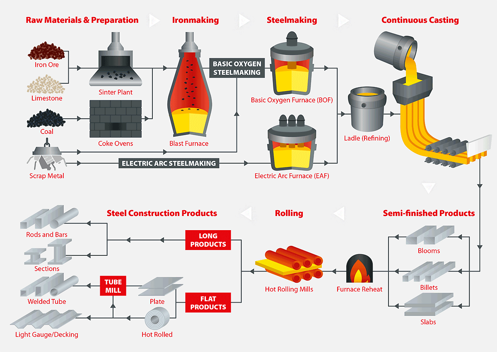
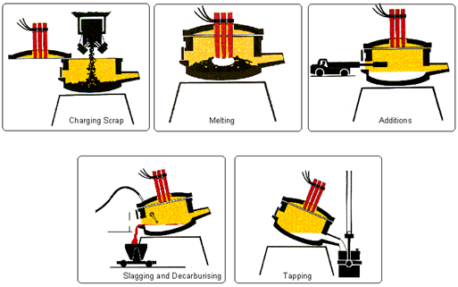
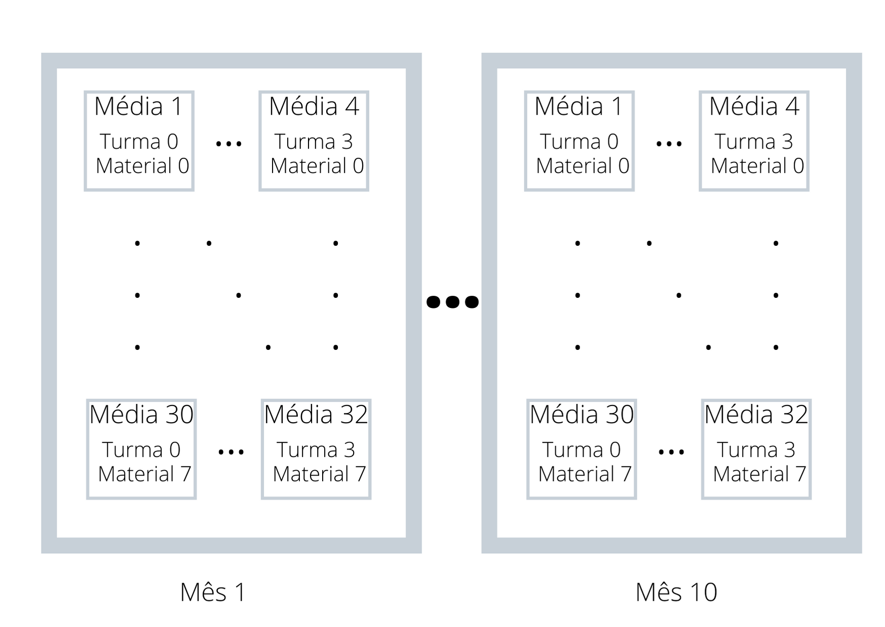

<script src="jquery.min.js"></script>

<script>
  $(document).ready(function() {
    $('slide:not(.backdrop):not(.title-slide)').append('<div class=\"footnotes\">');

    $('footnote').each(function(index) {
      var text  = $(this).html();
      var fnNum = (index+1).toString().sup();
      $(this).html(text + fnNum);

      var footnote   = fnNum + ': ' + $(this).attr('content') + '<br/>';
      var oldContent = $(this).parents('slide').children('div.footnotes').html();
      var newContent = oldContent + footnote;
      $(this).parents('slide').children('div.footnotes').html(newContent);
    });
  });
</script>


```{r setup, include=FALSE, warning=FALSE,echo=FALSE, message=FALSE}
knitr::opts_chunk$set(echo = FALSE)
options("kableExtra.html.bsTable" = T)

if (!require(ggplot2, quietly = TRUE)){
  install.packages("ggplot2")
}

if (!require(car, quietly = TRUE)){
  install.packages("car")
}

if (!require(boot, quietly = TRUE)){
  install.packages("boot")
}

if (!require(dplyr, quietly = TRUE)){
  install.packages("boot")
}

if (!require(ggridges, quietly = TRUE)){
  install.packages("ggridges")
}

if (!require(multcomp, quietly = TRUE)){
  install.packages("multcomp")
}

if (!require(knitr, quietly = TRUE)){
  install.packages("knitr")
}

if (!require(mvoutlier, quietly = TRUE)){
  install.packages("mvoutlier")
}

if (!require(reshape, quietly = TRUE)){
  install.packages("reshape")
}

if (!require(effects, quietly = TRUE)){
  install.packages("effects")
}

if (!require(kableExtra, quietly = TRUE)){
  install.packages("kableExtra")
}


```


```{r data_loading, include=FALSE, warning=FALSE,echo=FALSE, message=FALSE}
data.materials <- read.csv('data_pre_processed_filt_materials.csv')

data.materials$turma = as.factor(data.materials$Turma)
data.materials$material = as.factor(data.materials$Material)
data.materials$mes = as.factor(data.materials$Mês)
data.materials$turno = as.factor(data.materials$Turno)
```

## Agenda

- Introdução
- Revisão de literatura
- Planejamento do Experimento
- Descrição dos Dados
- Análise Exploratória
- Validação das premissas
- Resultados
- Conclusão

## Introdução | <footnote content="Disponível em https://www.newsteelconstruction.com/wp/an-introduction-to-steelmaking/"> Rotas de produção de aço</footnote>




## Introdução | <footnote content="Disponível em https://www.steelconstruction.info/Steel_manufacture"> Processo do Forno Elétrico</footnote>




## Descrição dos Dados {.smaller}

* Os dados consistem no consumo de oxigênio registrado no processo de produção de aço em um forno elétrico;
* Dados - Janeiro e Outubro de 2019;
* Cada instância representa uma execução independente do processo;
* Instâncias consideradas como outliers (erros de medição, valores absurdos) foram removidas;
* Os dados foram normalizados por uma constante aleatória, por questões de confidencialidade.

```{r table_ex, echo=FALSE}
kable(data.materials[1:3, c('turma', 'material', 'mes', 'VarConsumo_Quimica')]) %>% kable_styling(c("bordered","striped"), full_width = F)
```

## Revisão de Literatura {.smaller}

* **Blocagem** - Usada para eliminar ruídos conhecidos e controláveis [@Montgomery:2006:applied] - Será usada para retirar a Sazonalidade dos dados;

* **Experimento Fatorial** - Eficiente para estudo de efeitos de dois ou mais fatores [@Montgomery:2006:applied] - Será usado para analisar os dois fatores material e turma, e a interação entre eles.




## Planejamento do Experimento | Objetivo {.smaller}

O objetivo é comparar o desempenho de 4 turmas em relação ao consumo de oxigênio do processo, considerando também 9 diferentes materiais (tipos de aço) produzidos para a comparação.

Portanto, um experimento fatorial será realizado para os fatores **Turma** e **Material**. Além disso, a blocagem será realizada para o fator **Mês**, objetivando remover efeitos de sazonalidade dos dados. 

Isso resulta no seguinte modelo linear [@montgomery2007applied]:

$$\begin{equation}y_{ijk} = \mu + \tau_i + \beta_j + (\tau\beta)_{ij} + \delta_k +  \epsilon_{ijk}  \end{equation}$$

## Planejamento do Experimento | Hipóteses {.smaller}

Fator Turma:
$$\begin{cases} H_0: \tau_{i} = 0, \forall i &\\H_1:\exists \tau_{i} \neq 0 \end{cases}$$

Fator Material:
$$\begin{cases} H_0: \beta_{j} = 0, \forall j &\\H_1:\exists \beta_{j} \neq 0 \end{cases}$$
Efeito de interação:
$$\begin{cases} H_0: (\tau\beta)_{ij} = 0, \forall i,j &\\H_1:\exists (\tau\beta)_{ij} \neq 0 \end{cases}$$

## Planejamento do Experimento | Parâmetros experimentais {.smaller}

* Significância desejada: $\alpha = 0.05$.
* Mínima diferença de importância prática (padronizada): $d^* = \delta^*/\sigma = 0.3$ 
* Potência mínima desejada $\pi = 1 - \beta = 0.8$

O  $d^* = 0.3$ foi escolhido para detectar diferenças "médias" na magnitude [@10.1093/jpepsy/jsp004].

## Planejamento do Experimento | Cálculo do número de amostras {.smaller}

```{r blockcalculation_a, echo = FALSE}
a <- 4 # turmas
b <- 9 # materiais
d <- 0.3 # diferenca minima padrao
alpha <- 0.05
beta <- 0.2

tau <- c(-d, d, rep(0, a - 2)) # define tau vector
n <- 2

tb <- data.frame(n = rep(-1, 100), ratio = rep(-1,100), phi = rep(-1,100))

for(i in seq(10,30,by=3)){

  n <- i + 4
  f1 <- qf(1 - alpha, a - 1, a*b*(n - 1))
  phi <- b*n*sum(tau^2)/a
  f2 <- qf(beta, a - 1, a*b*(n - 1), phi)
  
  
  tb[i, ] = c(n, f1/f2, phi)
}

n_a <- min((tb %>% filter(ratio <= 1 & ratio > 0))$n)
#kable(tb %>% filter(ratio >= 0.5))
tb %>% filter(ratio >= 0.5) %>% kable() %>% kable_styling(c("bordered","striped"), full_width = F) %>% row_spec(6, bold = T, color = "red")

```

## Análise Exploratória {.smaller}
Número de amostras
```{r heat_count_table, echo=FALSE, fig.width=8,fig.height=5, fig.align='center'}

replications(VarConsumo_Quimica ~  turma * material + mes, data = data.materials)
#invisible(data.count <- cast(data.materials, turma ~ material, value='turno', fun.aggregate = length))
#colnames(data.count)[colnames(data.count)=="turma"] <- "turma/material"
#kable(data.count)

```


## Análise Exploratória {.smaller}

```{r heat_count, echo=FALSE, fig.width=8,fig.height=4, fig.align='center'}

ggplot(data.materials, aes(x=mes, y=VarConsumo_Quimica, fill=turma)) + 
  geom_boxplot() + facet_grid(rows=vars(material), scales = "free_y")


data.materials <- data.materials %>% filter(Material != 13)

```
O material 13 será removido por ter sido produzio somente em alguns meses do ano.

## Análise Exploratória  {.smaller}

```{r plot_eletrica, echo=FALSE, fig.width=7,fig.height=5, fig.align='center', fig.cap="Boxplot da variável química"}
ggplot(data.materials, aes(x=mes, y=VarConsumo_Quimica, fill = turma)) + 
  geom_boxplot() 


```


```{r aov_runs, echo=FALSE}
anv.quim <- aov(VarConsumo_Quimica ~  turma * material + mes, data = data.materials)
anv.quim.log <- aov(log(VarConsumo_Quimica) ~  turma * material + mes, data = data.materials)

shap.orig <- shapiro.test(anv.quim$residuals)
shap.log <- shapiro.test(anv.quim.log$residuals)

interfac <- with(data.materials,interaction(turma, material))
flig.log <- fligner.test(log(VarConsumo_Quimica) ~ interfac, data = data.materials)
```

## Validação das premissas | Normalidade {.smaller}
Teste de Shapiro-Wilk - p-valor = `r shap.orig$p.value`

```{r assum_norm, echo = FALSE, fig.width=8,fig.height=4, fig.align='center',  fig.cap="QQ plot para resíduos"}
invisible(qqPlot(anv.quim$residuals, dist='norm',envelope=.95, las = 1, pch = 16, ylab = "VarConsumo_Quimica"))

```

## Validação das premissas | Normalidade {.smaller}
Teste de Shapiro-Wilk (transformação logarítmica) - p-valor = `r shap.log$p.value`


```{r assum_norm_log, echo = FALSE, fig.width=8,fig.height=4, fig.align='center',  fig.cap="QQ plot para resíduos"}
invisible(qqPlot(anv.quim.log$residuals, dist='norm',envelope=.95, las = 1, pch = 16, ylab = "VarConsumo_Quimica"))

```

## Validação das premissas | Homocedasticidade {.smaller}

Teste de Fligner p-valor: `r flig.log$p.value`

```{r assum_homoc, echo = FALSE, fig.width=8,fig.height=4, fig.align='center',  fig.cap="Residuals vs Fitted"}

plot(anv.quim.log$fitted.values, anv.quim.log$residuals)
abline(lm(anv.quim.log$residuals ~ anv.quim.log$fitted.values), col="red")
```

## Validação das premissas | Independência {.smaller}

* Cada execução do processo é independente da outra
* Existem intâncias de diferentes meses e dias, o que garante ainda mais a independência
* Pode existir certa dependência se as instâncias forem analisadas de forma sequencial. Isso só seria observado dentro de uma mesma turma.


## Resultados {.smaller}

```{r summ_anv_quim, echo = TRUE}
summary(anv.quim.log)
```
```{r summ_anv_quim_lm, echo = TRUE}
summary.lm(anv.quim.log)$r.squared
```

## Resultados {.smaller}

```{r effects_plot_o2, echo = FALSE,  fig.width=7,fig.height=5, fig.align='center'}
ener.effs <- allEffects(anv.quim.log)
plot(ener.effs)
```

## Resultados {.smaller}

```{r effects_mpc_o2_turma, echo = FALSE, warning=FALSE,  fig.width=7,fig.height=5, fig.align='center'}
mcp.quim <- glht(anv.quim.log, linfct = mcp(turma = "Tukey"))
mcp.quim.CI <- confint(mcp.quim, level= 1 - alpha)
plot(mcp.quim.CI, main = 'Intervalos de confiança - Turma')
```

## Resultados {.smaller}

```{r effects_mpc_o2_material, echo = FALSE, warning=FALSE, fig.width=7,fig.height=5, fig.align='center'}
mcp.quim <- glht(anv.quim.log, linfct = mcp(material = "Tukey"))
#summary(mcp.quim)
plot(mcp.quim, main = 'Intervalos de confiança - Material')
```


## Resultados {.smaller}

```{r effects_mpc_o2_inter, echo = FALSE, warning=FALSE, fig.width=7,fig.height=5, fig.align='center'}
# Create meta-factor for interaction groups
interfac <- with(data.materials,interaction(turma, material))

# Use group with the smallest sample mean as the reference
ref <- with(data.materials, which.min(tapply(log(VarConsumo_Quimica), interfac, mean)))

interfac <- relevel(interfac, ref = "3.1")
# ReFit model
model2 <- aov(log(VarConsumo_Quimica) ~ mes + interfac, data = data.materials)

# Multiple comparisons
mcp.inter <- glht(model2, linfct = mcp(interfac = "Dunnett"))
plot(mcp.inter, main = 'Intervalos de confiança - Turma.Material')
```


## Conclusão

* O modelo possui um $R^2$ muito baixo: os fatores turma e material sozinhos conseguem explicar 6% da variância dos dados. Mesmo assim, os resultados do ANOVA não deixar de ser significativos, já que não estamos interessados na predição do consumo [@HowtoInt53:online].
* Não existem diferenças de consumo significativas ao se considerar somente o fator material
* A turma 3 possui diferença significativa em relação à 2 e 0, porém o mesmo não pode ser concluído para a 1.

## Referências
