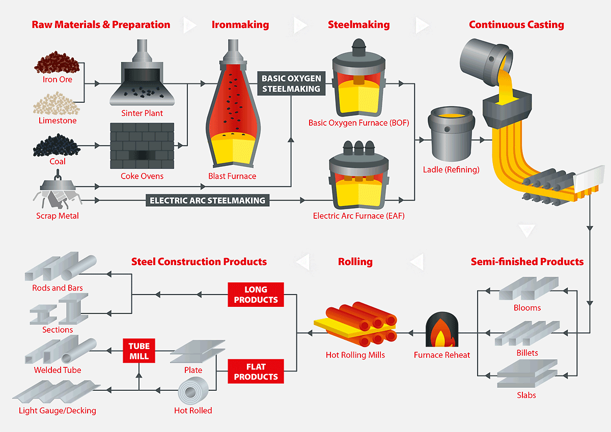
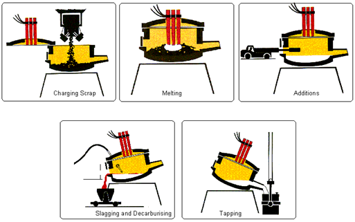

<script src="jquery.min.js"></script>

<script>
  $(document).ready(function() {
    $('slide:not(.backdrop):not(.title-slide)').append('<div class=\"footnotes\">');

    $('footnote').each(function(index) {
      var text  = $(this).html();
      var fnNum = (index+1).toString().sup();
      $(this).html(text + fnNum);

      var footnote   = fnNum + ': ' + $(this).attr('content') + '<br/>';
      var oldContent = $(this).parents('slide').children('div.footnotes').html();
      var newContent = oldContent + footnote;
      $(this).parents('slide').children('div.footnotes').html(newContent);
    });
  });
</script>


```{r setup, include=FALSE, warning=FALSE,echo=FALSE, message=FALSE}
knitr::opts_chunk$set(echo = FALSE)

if (!require(ggplot2, quietly = TRUE)){
  install.packages("ggplot2")
}

if (!require(car, quietly = TRUE)){
  install.packages("car")
}

if (!require(boot, quietly = TRUE)){
  install.packages("boot")
}

if (!require(dplyr, quietly = TRUE)){
  install.packages("boot")
}

if (!require(ggridges, quietly = TRUE)){
  install.packages("ggridges")
}

if (!require(multcomp, quietly = TRUE)){
  install.packages("multcomp")
}

if (!require(knitr, quietly = TRUE)){
  install.packages("knitr")
}

if (!require(mvoutlier, quietly = TRUE)){
  install.packages("mvoutlier")
}

if (!require(reshape, quietly = TRUE)){
  install.packages("reshape")
}

if (!require(effects, quietly = TRUE)){
  install.packages("effects")
}

```


```{r data_loading, include=FALSE, warning=FALSE,echo=FALSE, message=FALSE}
data <- read.csv('data_pre_processed_raw.csv')
data.materials <- read.csv('data_pre_processed_filt_materials.csv')

data$turma = as.factor(data$Turma)
data$material = as.factor(data$Material)
data$mes = as.factor(data$Mês)
data$turno = as.factor(data$Turno)

data.materials$turma = as.factor(data.materials$Turma)
data.materials$material = as.factor(data.materials$Material)
data.materials$mes = as.factor(data.materials$Mês)
data.materials$turno = as.factor(data.materials$Turno)
```

## Agenda

- Introdução
- Planejamento do Experimento
- Descrição dos Dados
- Análise Exploratória
- Validação das premissas
- Resultados
- Conclusão

## Introdução | <footnote content="Disponível em https://www.newsteelconstruction.com/wp/an-introduction-to-steelmaking/"> Rotas de produção de aço</footnote>




## Introdução | <footnote content="Disponível em https://www.steelconstruction.info/Steel_manufacture"> Processo do Forno Elétrico</footnote>



## Descrição dos Dados {.smaller}

* Os dados consistem de KPIs medidos de processo de produção de aço em um forno elétrico, coletados entre Janeiro e Outubro de 2019: consumo de energia elétrica, consumo de oxigênio e tempo de parada. 
* Cada instância representa uma execução independente do processo. 
* Instâncias consideradas como outliers (erros de medição, valores absurdos) foram removidas
* Os dados foram normalizados por uma constante aleatória, por questões de confidencialidade exigidas para os valores reais

```{r table_ex, echo=FALSE}
kable(data.materials[1:3, c('turma', 'material', 'mes', 'VarConsumo_Quimica', 'VarConsumo_Eletrica','VarTempoProcesso')] )
```


## Planejamento do Experimento | Objetivo {.smaller}

O objetivo é comparar o desempenho das turmas $T$ em relação aos três KPIs do processo,  considerando também diferentes materiais $M$ produzidos para a comparação.

Portanto, um experimento fatorial será realizado para os fatores **Turma** e **Material**. Além disso, a blocagem será realizada para o fator **Mês**, objetivando remover efeitos de sazonalidade dos dados. 

Isso resulta no seguinte modelo linear [@montgomery2007applied]:

$$\begin{equation}y_{ijk} = \mu + \tau_i + \beta_j + (\tau\beta)_{ij} + \delta_k +  \epsilon_{ijk}  \end{equation}$$

## Planejamento do Experimento | Hipóteses {.smaller}

Fator Turma:
$$\begin{cases} H_0: \tau_{i} = 0, \forall i &\\H_1:\exists \tau_{i} \neq 0 \end{cases}$$

Fator Material:
$$\begin{cases} H_0: \beta_{j} = 0, \forall j &\\H_1:\exists \beta_{j} \neq 0 \end{cases}$$
Efeito de interação:
$$\begin{cases} H_0: (\tau\beta)_{ij} = 0, \forall i,j &\\H_1:\exists (\tau\beta)_{ij} \neq 0 \end{cases}$$

## Planejamento do Experimento | Parâmetros experimentais {.smaller}

* Significância desejada: $\alpha = 0.05$.
* Mínima diferença de importância prática (padronizada): $d^* = \delta^*/\sigma = 0.5$
* Potência mínima desejada $\pi = 1 - \beta = 0.8$


## Planejamento do Experimento | Cálculo do número de amostras {.smaller}

```{r blockcalculation_a, echo = FALSE}
a <- 4 # turmas
b <- 9 # materiais
d <- 0.5 # diferenca minima padrao
alpha <- 0.05
beta <- 0.2

tau <- c(-d, d, rep(0, a - 2)) # define tau vector
n <- 2

tb <- data.frame(n = rep(-1, 50), ratio = rep(-1,50), phi = rep(-1,50))

for(i in seq(1,40,by=2)){

  n <- i + 2
  f1 <- qf(1 - alpha, a - 1, a*b*(n - 1))
  f2 <- qf(beta, a - 1, a*b*(n - 1), (b*n*sum(tau^2)/a))
  phi <- b*n*sum(tau^2)/a
  
  tb[i, ] = c(n, f1/f2, phi)
}

n_a <- min((tb %>% filter(ratio <= 1 & ratio > 0))$n)
kable(tb %>% filter(ratio >= 0.5))
```


## Análise Exploratória {.smallest}

```{r heat_count, echo=FALSE, fig.width=8,fig.height=5, fig.align='center'}

ggplot(data.materials, aes(x=mes, y=VarConsumo_Quimica, fill=turno)) + 
  geom_boxplot() + facet_grid(rows=vars(material), scales = "free_y")


data.materials <- data.materials %>% filter(Material != 13)

```
O material 13 será removido por ter sido produzio somente em alguns meses do ano.

## Análise Exploratória | Número de amostras {.smaller}

```{r heat_count_table, echo=FALSE, fig.width=8,fig.height=5, fig.align='center'}

invisible(data.count <- cast(data.materials, turma ~ material, value='turno', fun.aggregate = length))
colnames(data.count)[colnames(data.count)=="turma"] <- "turma/material"
kable(data.count)

```

## Análise Exploratória  {.smaller}

```{r plot_eletrica, echo=FALSE, fig.width=7,fig.height=5, fig.align='center', fig.cap="Boxplot da variável elétrica"}
ggplot(data.materials, aes(x=mes, y=VarConsumo_Eletrica, fill = turma)) + 
  geom_boxplot() 

```

## Análise Exploratória {.smaller}

```{r plot_quimica, echo=FALSE, fig.width=7,fig.height=5, fig.align='center', fig.cap="Boxplot da variável química"}
ggplot(data.materials, aes(x=mes, y=VarConsumo_Quimica, fill = turma)) + 
  geom_boxplot() 

```

## Análise Exploratória {.smaller}

```{r plot_tempo, echo=FALSE, fig.width=7,fig.height=5, fig.align='center',  fig.cap="Boxplot do tempo de parada"}
ggplot(data.materials, aes(x=mes, y=VarTempoProcesso, fill = turma)) + 
  geom_boxplot() 

```

## Validação das premissas | Normalidade {.smaller}

```{r assum_norm, echo = FALSE, fig.width=8,fig.height=4, fig.align='center',  fig.cap="QQ plot para resíduos"}
anv.quim <- aov((VarConsumo_Quimica) ~  mes + turma * material, data = data.materials)
anv.ener <- aov((VarConsumo_Eletrica) ~  turma * material + mes, data = data.materials)
anv.temp <- aov((VarTempoProcesso) ~  turma * material + mes, data = data.materials)

par(mfrow=c(1,3))
invisible(qqPlot(anv.quim$residuals, dist='norm',envelope=.95, las = 1, pch = 16, ylab = "VarConsumo_Quimica"))
invisible(qqPlot(anv.ener$residuals, dist='norm',envelope=.95, las = 1, pch = 16, ylab = "VarConsumo_Eletrica"))
invisible(qqPlot(anv.temp$residuals, dist='norm',envelope=.95, las = 1, pch = 16, ylab = "VarTempoProcesso"))

```

## Validação das premissas | Homocedasticidade {.smaller}

```{r assum_homoc, echo = FALSE, fig.width=8,fig.height=4, fig.align='center',  fig.cap="Residuals vs Fitted"}
par(mfrow=c(1,3))
plot(anv.quim$fitted.values, anv.quim$residuals)
abline(lm(anv.quim$residuals ~ anv.quim$fitted.values), col="red")

plot(anv.ener$fitted.values, anv.ener$residuals)
abline(lm(anv.ener$residuals ~ anv.ener$fitted.values), col="red")

plot(anv.temp$fitted.values, anv.temp$residuals)
abline(lm(anv.temp$residuals ~ anv.temp$fitted.values), col="red")

```

## Validação das premissas | Independência {.smaller}

## Resultados {.smaller}

```{r summ_anv_quim, echo = TRUE}
summary(anv.quim)
```

## Resultados {.smaller}

```{r inter_plot_elet, echo = FALSE,  fig.width=7,fig.height=5, fig.align='center'}
interaction.plot(data.materials$turma, data.materials$material, data.materials$VarConsumo_Eletrica, type="b", col=c(1:4),
   leg.bty="o", leg.bg="beige", lwd=2, pch=c(18,24,22), xlab = 'Turma', trace.label = 'Material')
```

## Resultados {.smaller}

```{r inter_plot_quim, echo = FALSE,  fig.width=7,fig.height=5, fig.align='center'}
interaction.plot(data.materials$turma, data.materials$material, data.materials$VarConsumo_Quimica, type="b", col=c(1:4),
   leg.bty="o", leg.bg="beige", lwd=2, pch=c(18,24,22), xlab = 'Turma', trace.label = 'Material')
```

## Resultados {.smaller}

```{r inter_plot_tempo, echo = FALSE,  fig.width=7,fig.height=5, fig.align='center'}
interaction.plot(data.materials$turma, data.materials$material, data.materials$VarTempoProcesso, type="b", col=c(1:4),
   leg.bty="o", leg.bg="beige", lwd=2, pch=c(18,24,22), xlab = 'Turma', trace.label = 'Material')
```

## Resultados {.smaller}

```{r effects_plot_o2, echo = FALSE,  fig.width=7,fig.height=5, fig.align='center'}
quim.effs <- allEffects(anv.quim)
plot(quim.effs)
```

## Resultados {.smaller}

```{r effects_mpc_o2_turma, echo = FALSE,  fig.width=7,fig.height=4, fig.align='center'}
mcp.quim <- glht(anv.quim, linfct = mcp(turma = "Tukey"))
#summary(mcp.quim)
plot(mcp.quim)
```

## Resultados {.smaller}

```{r effects_mpc_o2_material, echo = FALSE,  fig.width=7,fig.height=4, fig.align='center'}
mcp.quim <- glht(anv.quim, linfct = mcp(material = "Tukey"))
#summary(mcp.quim)
plot(mcp.quim)
```

## Conclusão

## Referências
