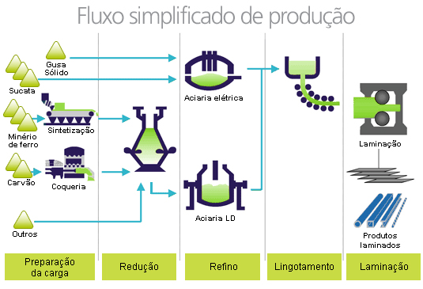

<script src="jquery.min.js"></script>

<script>
  $(document).ready(function() {
    $('slide:not(.backdrop):not(.title-slide)').append('<div class=\"footnotes\">');

    $('footnote').each(function(index) {
      var text  = $(this).html();
      var fnNum = (index+1).toString().sup();
      $(this).html(text + fnNum);

      var footnote   = fnNum + ': ' + $(this).attr('content') + '<br/>';
      var oldContent = $(this).parents('slide').children('div.footnotes').html();
      var newContent = oldContent + footnote;
      $(this).parents('slide').children('div.footnotes').html(newContent);
    });
  });
</script>


```{r setup, include=FALSE, warning=FALSE,echo=FALSE, message=FALSE}
knitr::opts_chunk$set(echo = FALSE)

if (!require(ggplot2, quietly = TRUE)){
  install.packages("ggplot2")
}

if (!require(car, quietly = TRUE)){
  install.packages("car")
}

if (!require(boot, quietly = TRUE)){
  install.packages("boot")
}

if (!require(dplyr, quietly = TRUE)){
  install.packages("boot")
}

if (!require(ggridges, quietly = TRUE)){
  install.packages("ggridges")
}

if (!require(multcomp, quietly = TRUE)){
  install.packages("multcomp")
}


```


```{r data_loading, include=FALSE, warning=FALSE,echo=FALSE, message=FALSE}
data <- read.csv('data_pre_processed_raw.csv')
data.materials <- read.csv('data_pre_processed_filt_materials.csv')

data$turma = as.factor(data$Turma)
data$material = as.factor(data$Material)
data$mes = as.factor(data$Mês)
data$turno = as.factor(data$Turno)

data.materials$turma = as.factor(data.materials$Turma)
data.materials$material = as.factor(data.materials$Material)
data.materials$mes = as.factor(data.materials$Mês)
data.materials$turno = as.factor(data.materials$Turno)
```

## Agenda

- Introdução
- Planejamento do Experimento
- Descrição dos Dados
- Análise Exploratória
- Validação das premissas
- Resultados
- Conclusão

## Introdução 

<footnote content="Imagem disponível em http://www.acobrasil.org.br/site2015/images/fluxo.jpg"> O fluxo de produção de aço pode ser visto na figura abaixo</footnote>




## Planejamento do Experimento | Objetivo {.smaller}

O objetivo é comparar o desempenho entre turmas ...

## Planejamento do Experimento | Hipóteses {.smaller}

Para a análise comparativa entre as configurações do algoritmo DE, determinou-se as seguintes hipóteses a serem testadas.
$$\begin{cases} H_0: \mu_{1} = \mu_{2}&\\H_1: \mu_{1} \neq \mu_{2}\end{cases}$$
Onde $\mu_{1}$ e $\mu_{2}$ são as médias amostrais das configurações 1 e 2 dos algoritmos, respectivamente. 

Além disso, foram definidos os seguintes parâmetros experimentais: 

* Significância desejada: $\alpha = 0.05$.
* Mínima diferença de importância prática (padronizada): $d^* = \delta^*/\sigma = 0.5$
* Potência mínima desejada $\pi = 1 - \beta = 0.8$

## Descrição dos Dados {.smaller}

* Os dados consistem de corridas de processo de produção de aço em um forno elétrico, coletados entre Janeiro e Outubro de 2019
* Cada instância representa uma execução do processo

## Análise Exploratória  {.smaller}

```{r plot_eletrica, echo=FALSE, fig.width=7,fig.height=5, fig.align='center', fig.cap="Boxplot da variável elétrica"}
ggplot(data, aes(x=mes, y=VarConsumo_Eletrica, fill = turma)) + 
  geom_boxplot() 

```

## Análise Exploratória {.smaller}


```{r plot_quimica, echo=FALSE, fig.width=7,fig.height=5, fig.align='center', fig.cap="Boxplot da variável química"}
ggplot(data, aes(x=mes, y=VarConsumo_Quimica, fill = turma)) + 
  geom_boxplot() 

```

## Análise Exploratória {.smaller}


```{r plot_tempo, echo=FALSE, fig.width=7,fig.height=5, fig.align='center',  fig.cap="Boxplot do tempo de parada"}
ggplot(data, aes(x=mes, y=VarTempoProcesso, fill = turma)) + 
  geom_boxplot() 

```

## Validação das premissas | Normalidade {.smaller}

```{r assum_norm, echo = FALSE, fig.width=7,fig.height=4, fig.align='center',  fig.cap="QQ plot para resíduos"}
anv <- aov((VarConsumo_Quimica) ~  turno * material, data = data.materials)

invisible(qqPlot(anv$residuals, dist='norm',envelope=.95, las = 1, pch = 16, ylab = "VarConsumo_Quimica"))
```

## Validação das premissas | Homocedasticidade {.smaller}

```{r assum_homoc, echo = FALSE, fig.width=7,fig.height=4, fig.align='center',  fig.cap="Residuals vs Fitted"}
plot(anv)

```

## Validação das premissas | Independência {.smaller}

## Resultados {.smaller}

```{r summ_anv, echo = TRUE}
summary(anv)
```

## Conclusão

## Referências
